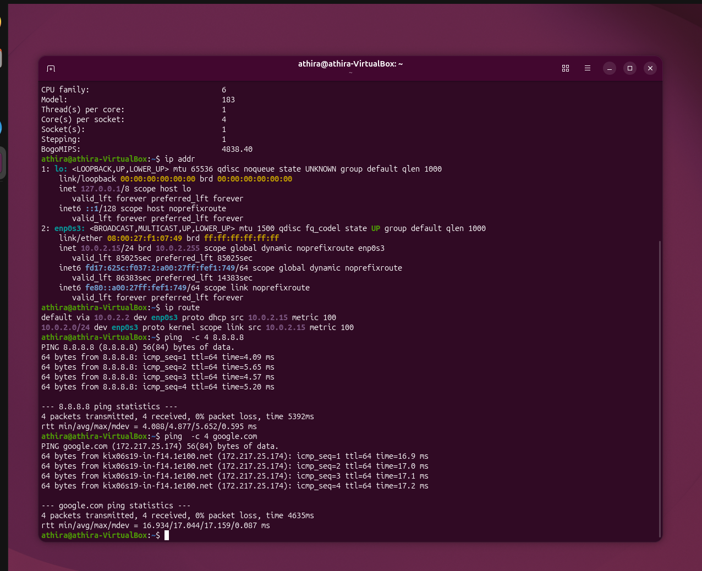
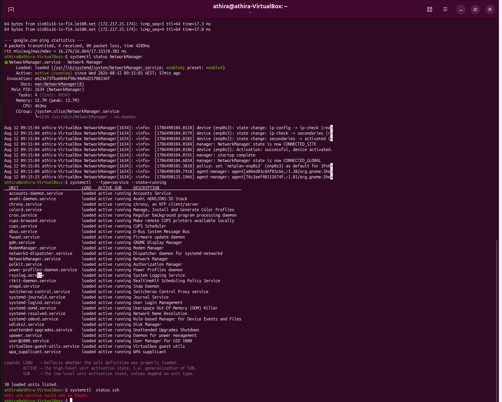
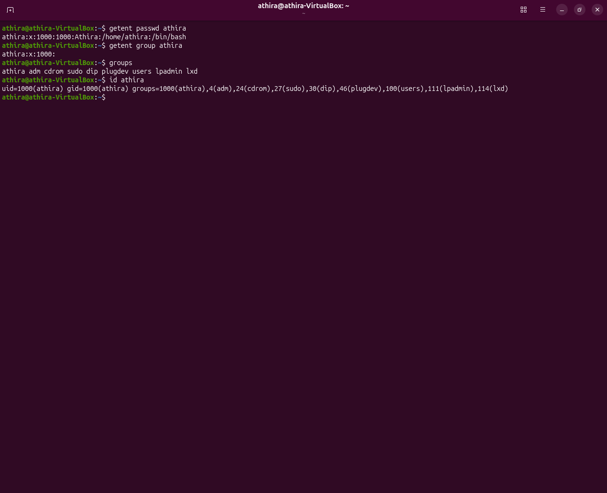
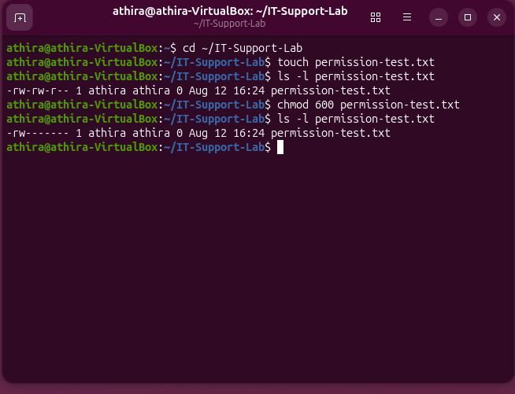
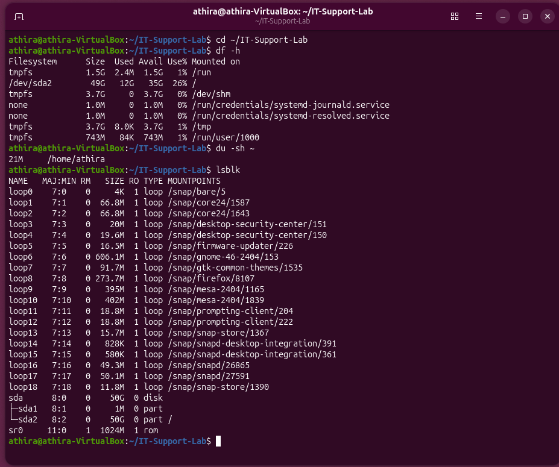
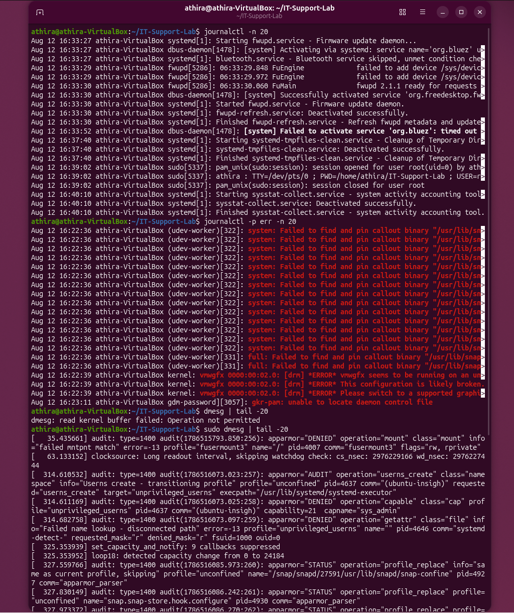
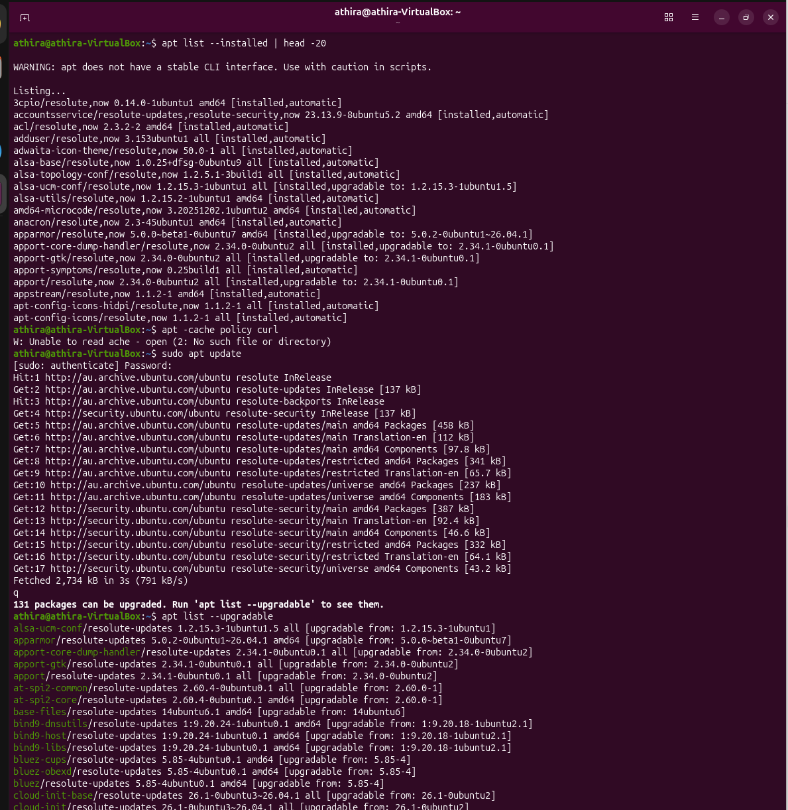
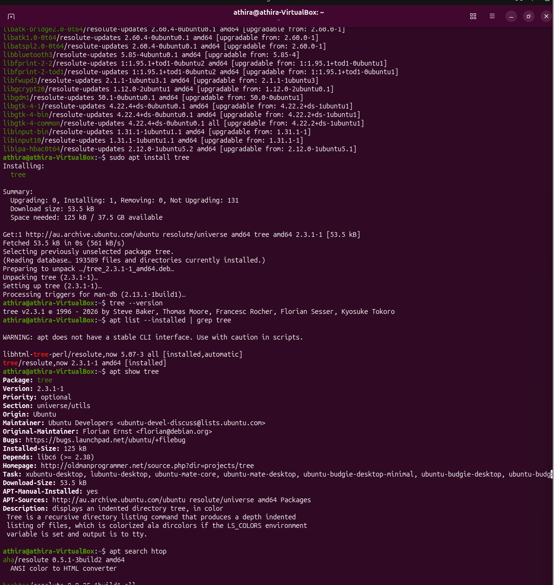
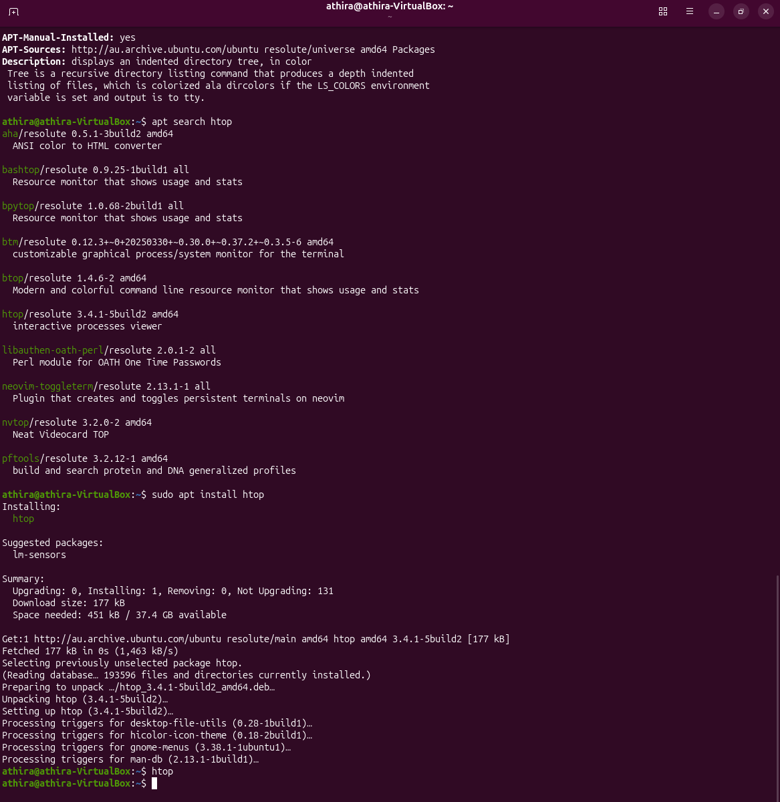
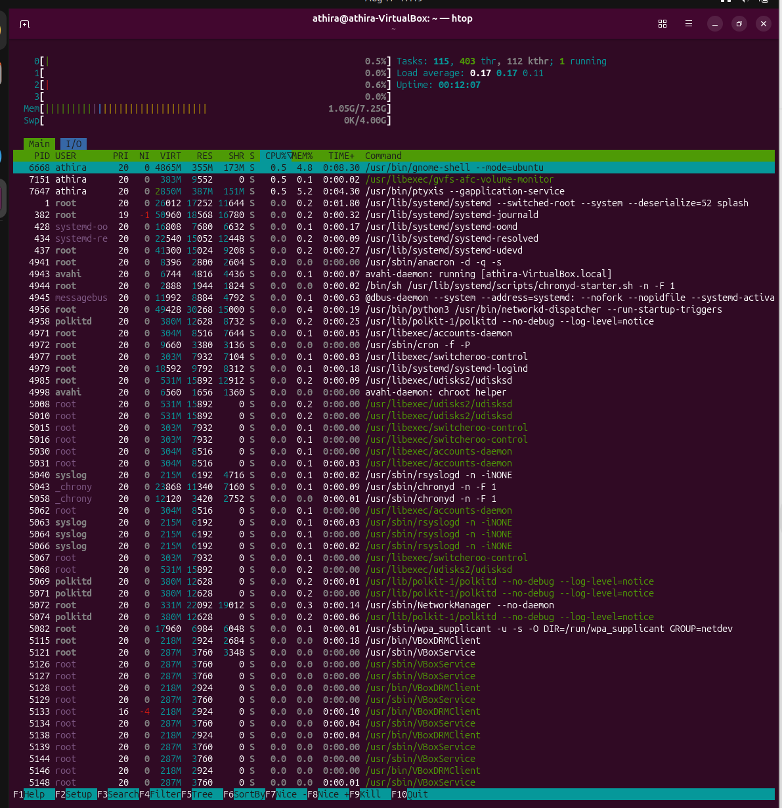

# Linux Basic Troubleshooting

## 📌 Overview

This project documents hands-on Linux administration and troubleshooting tasks performed in a Linux environment.

The goal is to build practical Linux skills for IT Support and Cybersecurity roles.

## 🎯 Objectives

- Understand basic Linux commands
- Navigate the Linux file system
- Manage files and directories
- Understand users and permissions
- Investigate running processes
- Check system resources
- Perform basic network troubleshooting
- Understand Linux services

## 🛠️ Tools Used

- Ubuntu Linux
- Terminal
- Bash
- SSH
- Linux command-line utilities

## 🧪 Lab Tasks

### 1. System Information

Commands used:

```bash
uname -a
hostname
whoami
```

### Results

- Operating System: Ubuntu Linux
- Architecture: x86_64
- Kernel: 7.0.0-28-generic
- Hostname: athira-VirtualBox
- Current user: athira

**Status:** ✅ Completed

## 📸 Evidence

### System Information


### 2. File & Directory Management

Created and managed files and directories using Linux commands.

Commands used:

```bash
pwd
mkdir IT-Support-Lab
cd IT-Support-Lab
touch test.txt
mkdir documents
ls -l
```

### Results

- Created IT-Support-Lab directory
- Created test.txt file
- Created documents directory
- Used `ls -l` to verify files and permissions

**Status:** ✅ Completed

## 📸 Evidence

### File & Directory Management


### 3. Users & Permissions

Investigated Linux users, groups, ownership, and file permissions.

Commands used:

```bash
whoami
id
ls -l
```

### Results
- Verified the current Linux user
- Reviewed user and group information
- Checked file and directory ownership
- Reviewed Linux file permissions
**Status:** ✅ Completed

## 📸 Evidence

### Users & Permissions


### 4. Running Processes

Investigated running processes and system resource usage using Linux process-monitoring commands.

Commands used:

```bash
ps
ps aux
top
```
Results
- Viewed currently running processes
- Reviewed processes for all users
- Monitored CPU and memory usage
- Used top to monitor active processes

**Status:** ✅ Completed

## 📸 Evidence

### Running Processes


### 5. System Resources

Checked system memory, disk usage, CPU information, and system uptime.

Commands used:

```bash
free -h
df -h
uptime
lscpu | head -15
```
Results
- Reviewed system memory usage
- Checked available disk space
- Reviewed system uptime and load
- Checked CPU architecture and processor information

**Status:** ✅ Completed

## 📸 Evidence
### system-resources


### 6. Network Troubleshooting

Investigated network configuration, routing, and internet connectivity using Linux commands.

Commands used:

```bash
ip addr
ip route
ping -c 4 8.8.8.8
ping -c 4 google.com
```
Results
- Checked network interfaces and IP address configuration
- Verified the default gateway and routing table
- Confirmed internet connectivity using 8.8.8.8
- Confirmed DNS resolution and connectivity to google.com

**Status:** ✅ Completed
## 📸 Evidence

### Network Troubleshooting



### 7. DNS Troubleshooting

Investigated DNS resolution and verified DNS configuration using Linux commands.

Commands used:

```bash
nslookup google.com
resolvectl status
ping -c 4 google.com
```
Results
- Successfully resolved google.com using DNS
- Verified the configured DNS server
- Confirmed DNS resolution and internet connectivity
- Verified 0% packet loss

**Status:** ✅ Completed
## 📸 Evidence

### DNS Troubleshooting


### 8. Linux Services

Investigated Linux services and checked their current running status using systemd commands.

Commands used:

```bash
systemctl status NetworkManager
systemctl --type=service --state=running
systemctl status ssh
```
Results
- Verified that NetworkManager is active and running
- Reviewed currently running Linux services
- Checked the status of the SSH service
- Confirmed that SSH service is not installed on the system

**Status:** ✅ Completed
## 📸 Evidence

### Linux Services


## 9. User & Group Management

Investigated Linux user accounts, groups, user IDs, group IDs, and group memberships.

### Commands used:

```bash
getent passwd athira
getent group athira
groups
id athira
```
Results
- Reviewed the Linux user account information
- Verified the user's home directory and default shell
- Checked the user's primary group
- Reviewed the user's group memberships
- Verified the user's UID and GID
- Reviewed additional groups assigned to the user

**Status:** ✅ Completed
## 📸 Evidence

### User & Group Management


## 10. File Ownership & Permissions

Investigated Linux file ownership and permissions and used `chmod` to restrict access to a file.

### Commands used:

```bash
touch permission-test.txt
ls -l permission-test.txt
chmod 600 permission-test.txt
ls -l permission-test.txt
```

### Results

- Created a test file
- Reviewed the file owner and group
- Checked the initial file permissions
- Changed the file permissions using `chmod 600`
- Verified that only the owner has read and write permissions

**Status:** ✅ Completed

## 📸 Evidence

### File Ownership & Permissions



## 11. Disk & Storage Troubleshooting

Investigated Linux disk usage, storage capacity, partitions, and mounted filesystems.

### Commands used:

```bash
df -h
du -sh ~
lsblk
```

### Results

* Reviewed filesystem disk usage and available space
* Checked the size of the user's home directory
* Identified available disks and partitions
* Reviewed mounted filesystems and storage devices

**Status:** ✅ Completed

## 📸 Evidence

### Disk & Storage Troubleshooting



## 12. Log & Error Troubleshooting

Investigated Linux system logs, error messages, and kernel events to support troubleshooting.

### Commands used:

```bash
journalctl -n 20
journalctl -p err -n 20
dmesg | tail -20
sudo dmesg | tail -20
```
### Results

- Reviewed recent system log entries
- Checked error-level system messages
- Reviewed kernel messages
- Identified system and application-related events for troubleshooting

**Status:** ✅ Completed

## 📸 Evidence

### Log & Error Troubleshooting


## 13. Package Management

Practised Linux package management using `apt` to update package information, search for packages, install software, and check available updates.

### Commands used:

```bash
sudo apt update
apt list --upgradable
sudo apt install tree
tree --version
apt list --installed | grep tree
apt show tree
apt search htop
sudo apt install htop
```
### Results
- Updated the APT package repository information
- Checked available package updates
- Installed and verified the tree package
- Checked installed package information using apt show
- Searched for the htop package
- Installed htop for system monitoring
- Used htop to view running processes and system resource usage

**Status:** ✅ Completed

## 📸 Evidence

### Package Management






#### htop System Monitor

