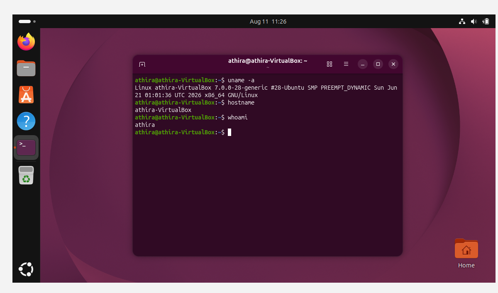
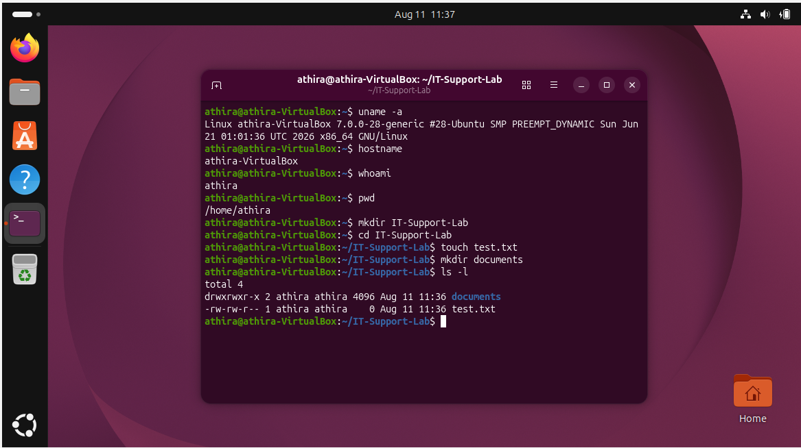
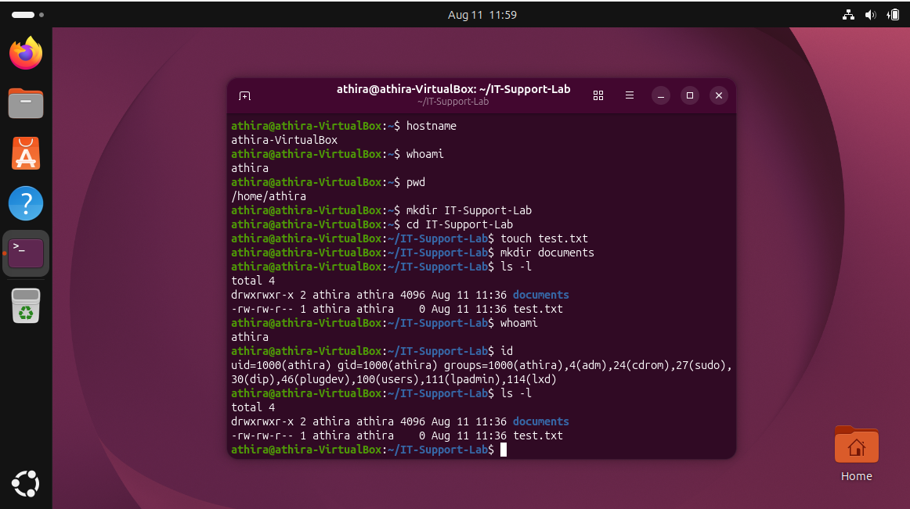
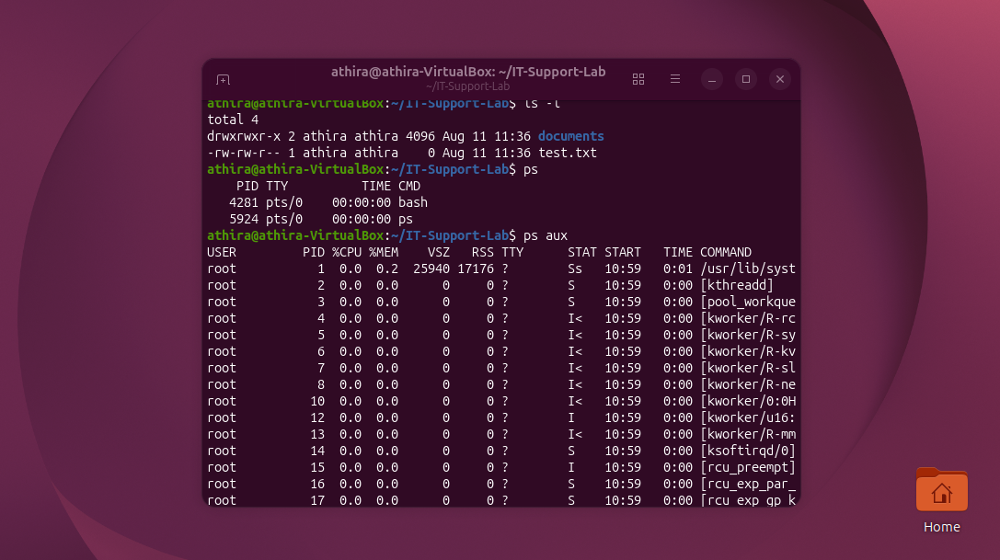
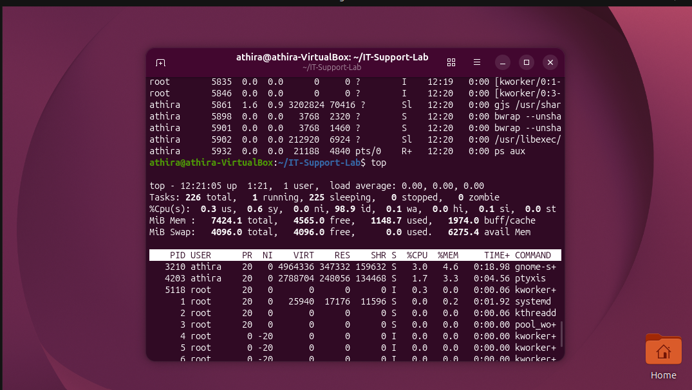
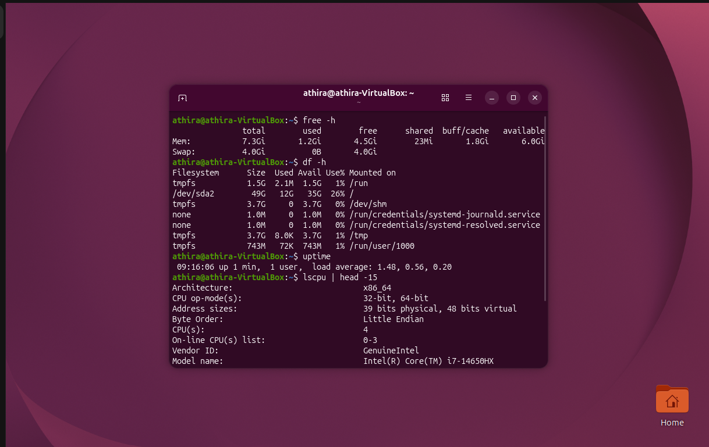
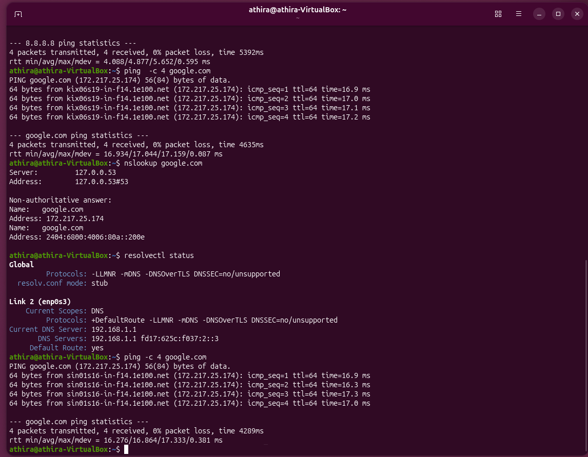

# Linux Basic Troubleshooting

## 📌 Overview

This project documents hands-on Linux administration and troubleshooting tasks performed in a Linux environment.

The goal is to build practical Linux skills for IT Support and Cybersecurity roles.

## 🎯 Objectives

- Understand basic Linux commands
- Navigate the Linux file system
- Manage files and directories
- Understand users and permissions
- Investigate running processes
- Check system resources
- Perform basic network troubleshooting
- Understand Linux services

## 🛠️ Tools Used

- Ubuntu Linux
- Terminal
- Bash
- SSH
- Linux command-line utilities

## 🧪 Lab Tasks

### 1. System Information

Commands used:

```bash
uname -a
hostname
whoami
```

### Results

- Operating System: Ubuntu Linux
- Architecture: x86_64
- Kernel: 7.0.0-28-generic
- Hostname: athira-VirtualBox
- Current user: athira

**Status:** ✅ Completed

## 📸 Evidence

### System Information


### 2. File & Directory Management

Created and managed files and directories using Linux commands.

Commands used:

```bash
pwd
mkdir IT-Support-Lab
cd IT-Support-Lab
touch test.txt
mkdir documents
ls -l
```

### Results

- Created IT-Support-Lab directory
- Created test.txt file
- Created documents directory
- Used `ls -l` to verify files and permissions

**Status:** ✅ Completed

## 📸 Evidence

### File & Directory Management


### 3. Users & Permissions

Investigated Linux users, groups, ownership, and file permissions.

Commands used:

```bash
whoami
id
ls -l
```

### Results
- Verified the current Linux user
- Reviewed user and group information
- Checked file and directory ownership
- Reviewed Linux file permissions
**Status:** ✅ Completed

## 📸 Evidence

### Users & Permissions


### 4. Running Processes

Investigated running processes and system resource usage using Linux process-monitoring commands.

Commands used:

```bash
ps
ps aux
top
```
Results
- Viewed currently running processes
- Reviewed processes for all users
- Monitored CPU and memory usage
- Used top to monitor active processes

**Status:** ✅ Completed

## 📸 Evidence

### Running Processes



### 5. System Resources

Checked system memory, disk usage, CPU information, and system uptime.

Commands used:

```bash
free -h
df -h
uptime
lscpu | head -15
```
Results
- Reviewed system memory usage
- Checked available disk space
- Reviewed system uptime and load
- Checked CPU architecture and processor information

**Status:** ✅ Completed

## 📸 Evidence
### system-resources


### 6. DNS Troubleshooting

Investigated DNS resolution and verified DNS configuration using Linux commands.

Commands used:

```bash
nslookup google.com
resolvectl status
ping -c 4 google.com
```
Results
- Successfully resolved google.com using DNS
- Verified the configured DNS server
- Confirmed DNS resolution and internet connectivity
- Verified 0% packet loss

**Status:** ✅ Completed
## 📸 Evidence

### DNS Troubleshooting



