# Linux Basic Troubleshooting

## 📌 Overview

This project documents hands-on Linux administration and troubleshooting tasks performed in a Linux environment.

The goal is to build practical Linux skills for IT Support and Cybersecurity roles.

## 🎯 Objectives

- Understand basic Linux commands
- Navigate the Linux file system
- Manage files and directories
- Understand users and permissions
- Investigate running processes
- Check system resources
- Perform basic network troubleshooting
- Understand Linux services

## 🛠️ Tools Used

- Ubuntu Linux
- Terminal
- Bash
- SSH
- Linux command-line utilities

## 🧪 Lab Tasks

### 1. System Information

Commands used:

```bash
uname -a
hostname
whoami
```

### Results

- Operating System: Ubuntu Linux
- Architecture: x86_64
- Kernel: 7.0.0-28-generic
- Hostname: athira-VirtualBox
- Current user: athira

**Status:** ✅ Completed

## 📸 Evidence

### System Information


### 2. File & Directory Management

Created and managed files and directories using Linux commands.

Commands used:

```bash
pwd
mkdir IT-Support-Lab
cd IT-Support-Lab
touch test.txt
mkdir documents
ls -l
```

### Results

- Created IT-Support-Lab directory
- Created test.txt file
- Created documents directory
- Used `ls -l` to verify files and permissions

**Status:** ✅ Completed

## 📸 Evidence

### File & Directory Management


### 3. Users & Permissions

Investigated Linux users, groups, ownership, and file permissions.

Commands used:

```bash
whoami
id
ls -l
```

### Results
- Verified the current Linux user
- Reviewed user and group information
- Checked file and directory ownership
- Reviewed Linux file permissions
**Status:** ✅ Completed

## 📸 Evidence

### Users & Permissions


### 4. Running Processes

Investigated running processes and system resource usage using Linux process-monitoring commands.

Commands used:

```bash
ps
ps aux
top
```
Results
- Viewed currently running processes
- Reviewed processes for all users
- Monitored CPU and memory usage
- Used top to monitor active processes

**Status:** ✅ Completed

## 📸 Evidence

### Running Processes


### 5. System Resources

Checked system memory, disk usage, CPU information, and system uptime.

Commands used:

```bash
free -h
df -h
uptime
lscpu | head -15
```
Results
- Reviewed system memory usage
- Checked available disk space
- Reviewed system uptime and load
- Checked CPU architecture and processor information

**Status:** ✅ Completed

## 📸 Evidence
### system-resources


### 6. Network Troubleshooting

Investigated network configuration, routing, and internet connectivity using Linux commands.

Commands used:

```bash
ip addr
ip route
ping -c 4 8.8.8.8
ping -c 4 google.com
```
Results
- Checked network interfaces and IP address configuration
- Verified the default gateway and routing table
- Confirmed internet connectivity using 8.8.8.8
- Confirmed DNS resolution and connectivity to google.com

**Status:** ✅ Completed
## 📸 Evidence

### Network Troubleshooting


### 7. DNS Troubleshooting

Investigated DNS resolution and verified DNS configuration using Linux commands.

Commands used:

```bash
nslookup google.com
resolvectl status
ping -c 4 google.com
```
Results
- Successfully resolved google.com using DNS
- Verified the configured DNS server
- Confirmed DNS resolution and internet connectivity
- Verified 0% packet loss

**Status:** ✅ Completed
## 📸 Evidence

### DNS Troubleshooting


### 8. Linux Services

Investigated Linux services and checked their current running status using systemd commands.

Commands used:

```bash
systemctl status NetworkManager
systemctl --type=service --state=running
systemctl status ssh
```
Results
- Verified that NetworkManager is active and running
- Reviewed currently running Linux services
- Checked the status of the SSH service
- Confirmed that SSH service is not installed on the system

**Status:** ✅ Completed
## 📸 Evidence

### Linux Services


## 9. User & Group Management

Investigated Linux user accounts, groups, user IDs, group IDs, and group memberships.

### Commands used:

```bash
getent passwd athira
getent group athira
groups
id athira
```
Results
- Reviewed the Linux user account information
- Verified the user's home directory and default shell
- Checked the user's primary group
- Reviewed the user's group memberships
- Verified the user's UID and GID
- Reviewed additional groups assigned to the user

**Status:** ✅ Completed
## 📸 Evidence

### User & Group Management


## 10. File Ownership & Permissions

Investigated Linux file ownership and permissions and used `chmod` to restrict access to a file.

### Commands used:

```bash
touch permission-test.txt
ls -l permission-test.txt
chmod 600 permission-test.txt
ls -l permission-test.txt
```

### Results

- Created a test file
- Reviewed the file owner and group
- Checked the initial file permissions
- Changed the file permissions using `chmod 600`
- Verified that only the owner has read and write permissions

**Status:** ✅ Completed

## 📸 Evidence

### File Ownership & Permissions


## 11. Disk & Storage Troubleshooting

Investigated Linux disk usage, storage capacity, partitions, and mounted filesystems.

### Commands used:

```bash
df -h
du -sh ~
lsblk
```

### Results

* Reviewed filesystem disk usage and available space
* Checked the size of the user's home directory
* Identified available disks and partitions
* Reviewed mounted filesystems and storage devices

**Status:** ✅ Completed

## 📸 Evidence

### Disk & Storage Troubleshooting


## 12. Log & Error Troubleshooting

Investigated Linux system logs, error messages, and kernel events to support troubleshooting.

### Commands used:

```bash
journalctl -n 20
journalctl -p err -n 20
dmesg | tail -20
sudo dmesg | tail -20
```
### Results

- Reviewed recent system log entries
- Checked error-level system messages
- Reviewed kernel messages
- Identified system and application-related events for troubleshooting

**Status:** ✅ Completed

## 📸 Evidence

### Log & Error Troubleshooting


## 13. Package Management

Practised Linux package management using `apt` to update package information, search for packages, install software, and check available updates.

### Commands used:

```bash
sudo apt update
apt list --upgradable
sudo apt install tree
tree --version
apt list --installed | grep tree
apt show tree
apt search htop
sudo apt install htop
```
### Results
- Updated the APT package repository information
- Checked available package updates
- Installed and verified the tree package
- Checked installed package information using apt show
- Searched for the htop package
- Installed htop for system monitoring
- Used htop to view running processes and system resource usage

**Status:** ✅ Completed

## 📸 Evidence

### Package Management


#### htop System Monitor

## 14. Process Management

### Commands Used
- `ps aux` – Lists all running processes.
- `ps aux | head -20` – Displays the first 20 running processes.
- `top` – Monitors processes and system resource usage in real time.
- `pgrep -a systemd` – Finds processes related to systemd.
- `ps -p 1 -o pid,comm,%cpu,%mem` – Displays details of a specific process.

### What I Learned
I learned how to view, monitor, search, and inspect running processes in Linux. I also learned how to check CPU and memory usage for specific processes.

### Screenshots

#### 1. Viewing Running Processes
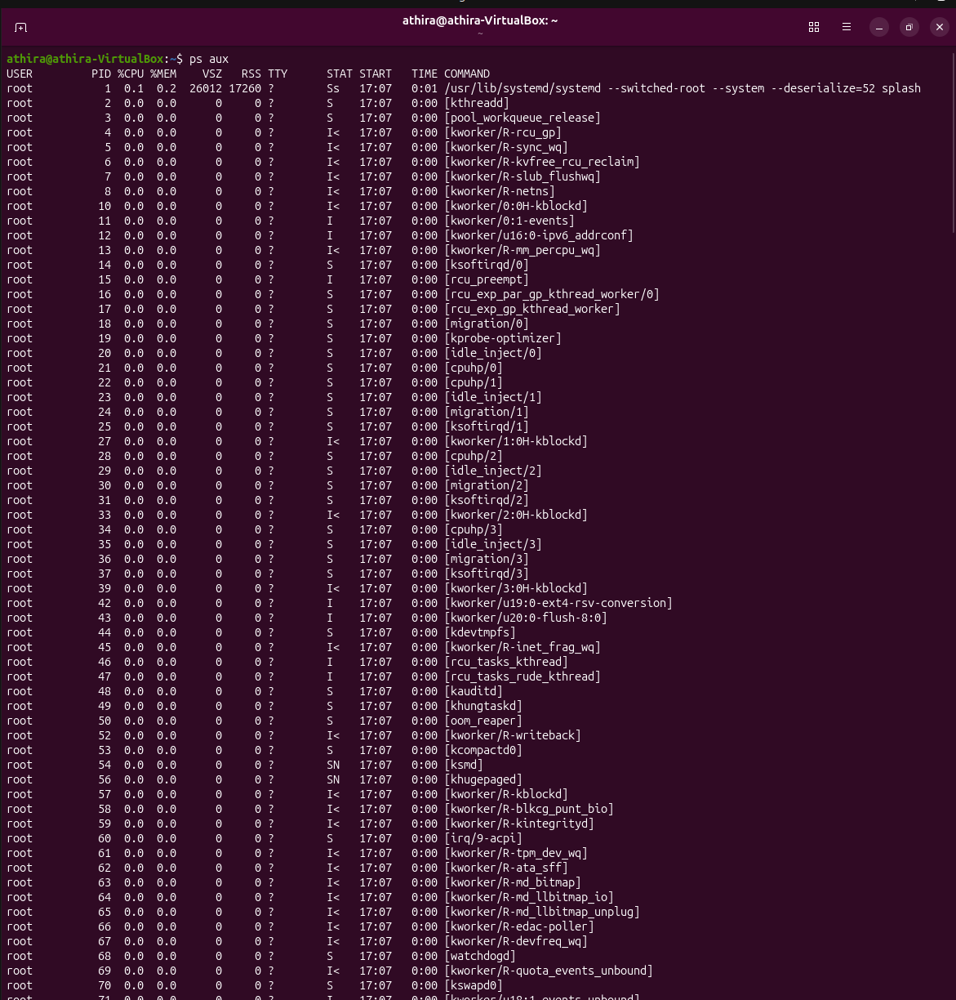

#### 2. Monitoring Processes with top
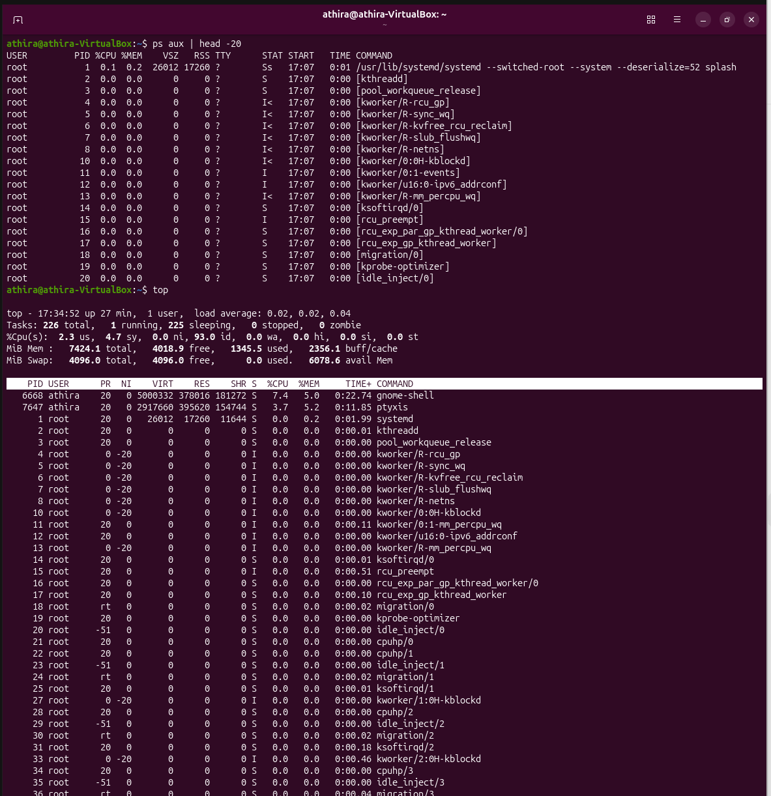

#### 3. Finding and Inspecting a Process
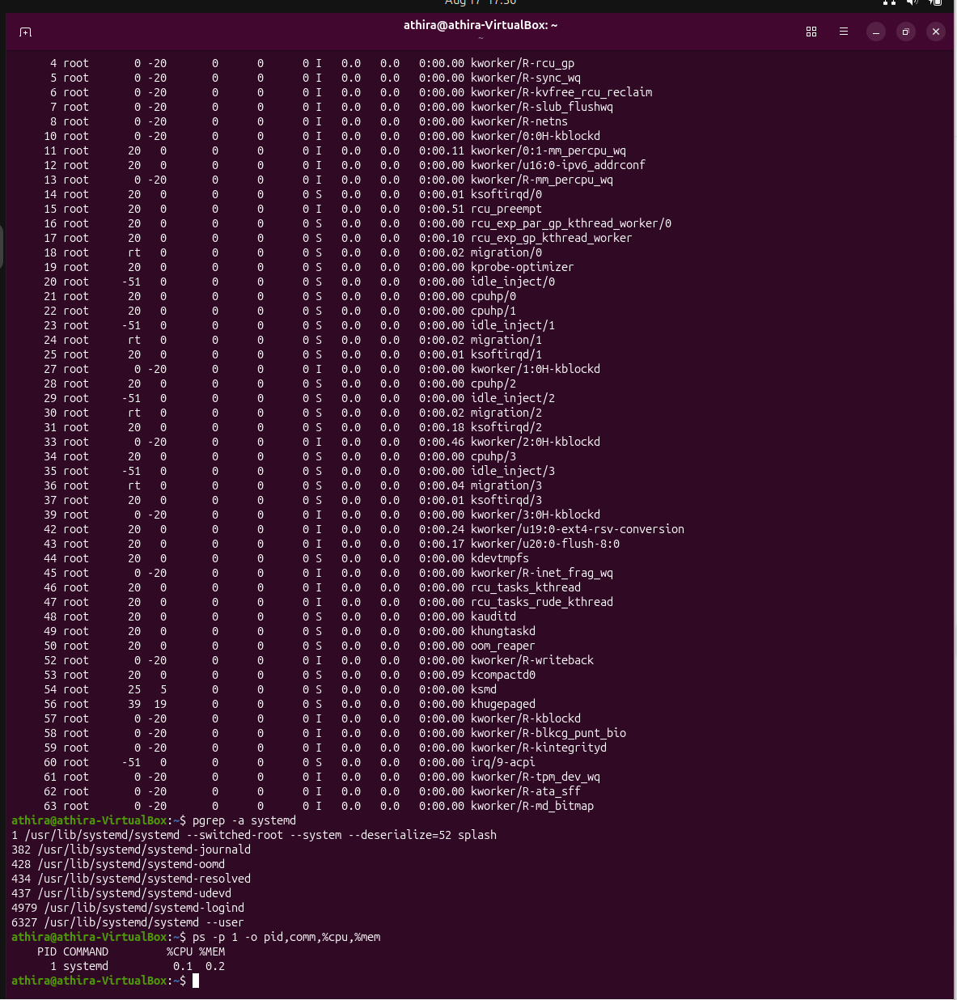
## Task 15 – System Resource Monitoring

### Objective
Learn how to monitor system resources such as CPU, memory, swap, disk usage, and running processes.

### Commands Used

```bash
uptime
free -h
df -h
top
ps aux --sort=-%cpu | head -10
ps aux --sort=-%mem | head -10
```
### What I Learned
uptime – Displays system uptime and load average.
free -h – Displays memory and swap usage.
df -h – Displays disk space usage.
top – Displays real-time CPU, memory, and running process information.
ps aux --sort=-%cpu | head -10 – Displays the processes using the most CPU.
ps aux --sort=-%mem | head -10 – Displays the processes using the most memory.
### Screenshots

#### System Resource Monitoring
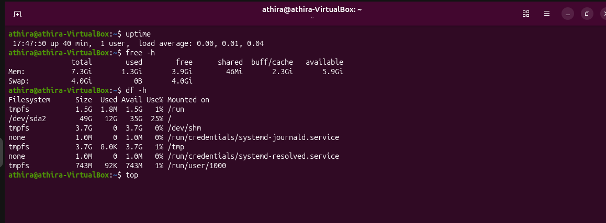

#### Top Command
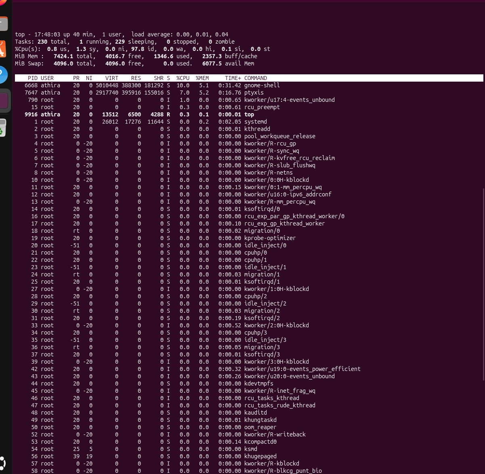

#### CPU and Memory Usage
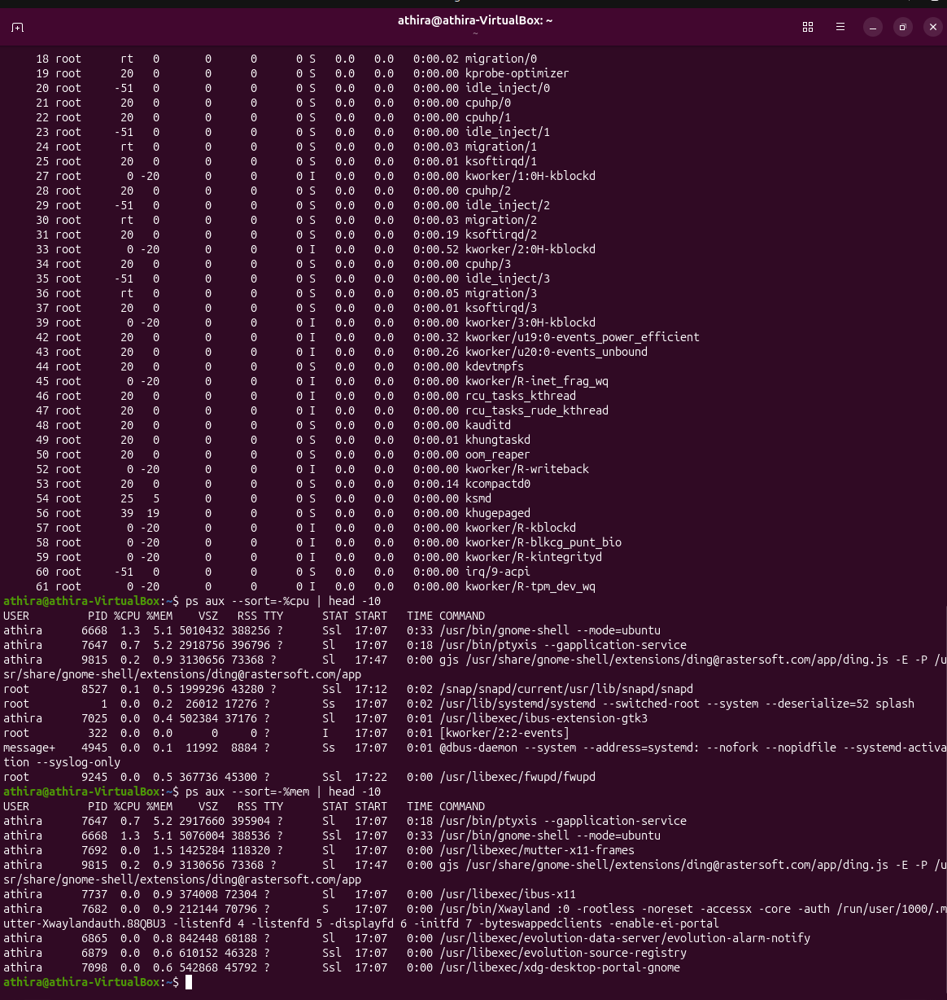
## Task 16 – Disk & Storage Troubleshooting

### Objective

Learn how to check disk space, partitions, mounted filesystems, directory sizes, and inode usage for basic Linux storage troubleshooting.

### Commands Used

```bash
df -h
du -sh ~
du -sh ~/Downloads
lsblk
mount | column -t
du -ah ~ | sort -rh | head -10
df -i
```
### What I Learned
df -h – Displays available and used disk space in a human-readable format.
du -sh – Shows the total size of a directory.
lsblk – Displays disks, partitions, and their mount points.
mount | column -t – Displays mounted filesystems in a readable format.
du -ah ~ | sort -rh | head -10 – Identifies the largest files and directories in the home directory.
df -i – Displays inode usage for mounted filesystems.

### Troubleshooting Notes

During the task, column was initially not available, which produced a "command not found" message. I then ran the command again and successfully displayed the mounted filesystem information.

The disk usage check showed that the main filesystem /dev/sda2 had approximately 25% disk usage, with sufficient free space available.
### Screenshots

#### Disk Space and Partition Information

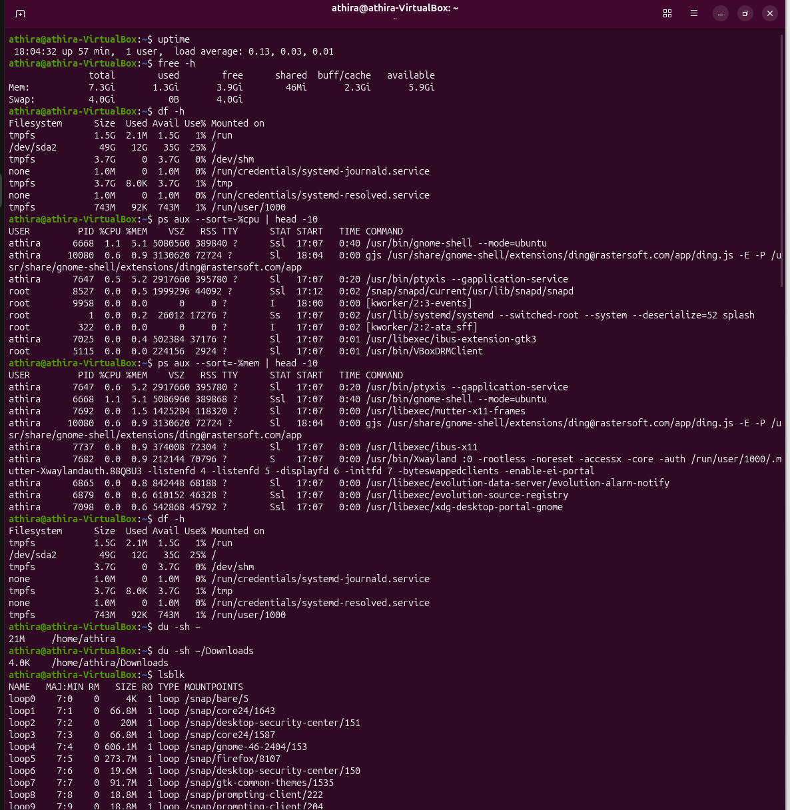

#### Mounted Filesystems

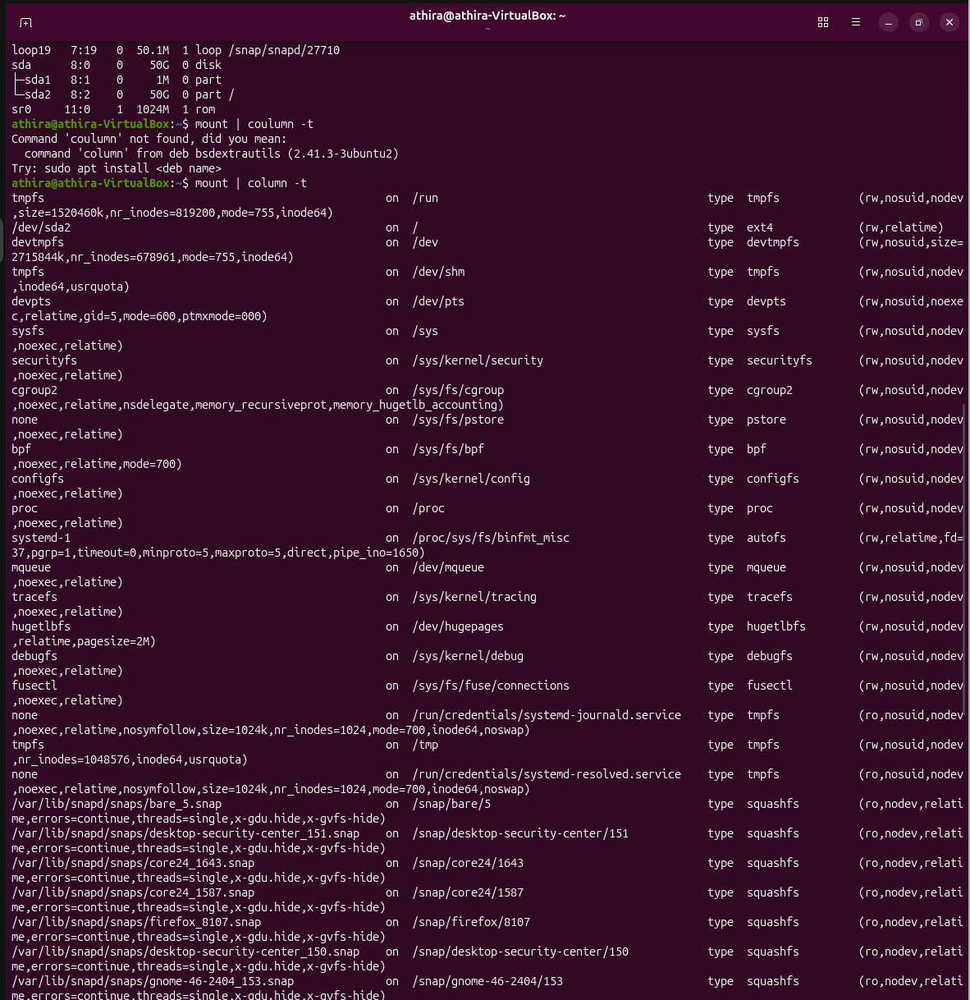

#### Storage and Inode Usage

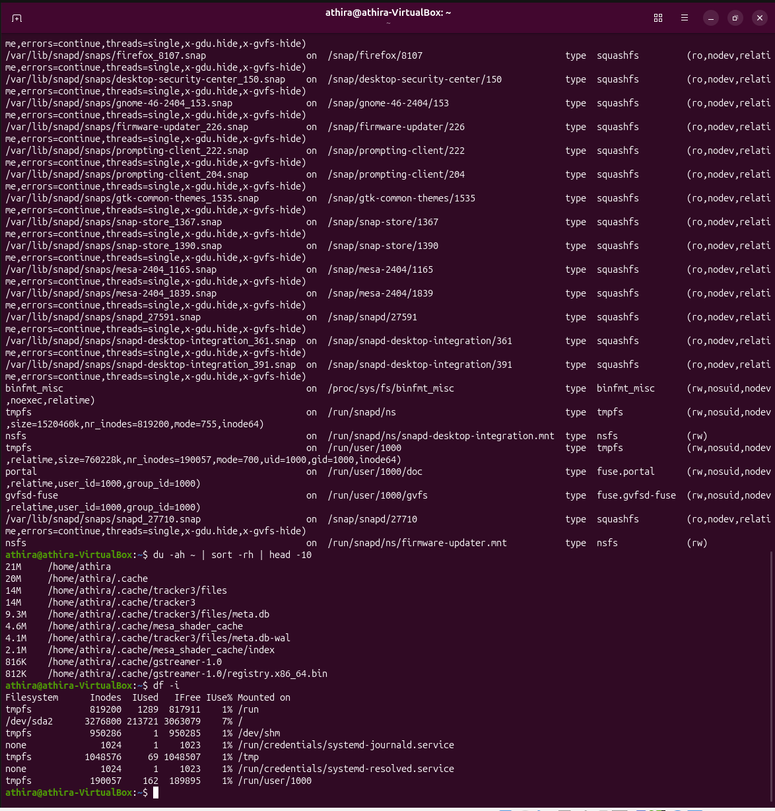

## Task 17 – Log & Error Troubleshooting

### Objective

Learn how to view Linux system logs, identify errors and warnings, and check kernel messages for basic troubleshooting.

### Commands Used

```bash
journalctl -n 20
journalctl -p err -n 10
journalctl -p warning -n 10
sudo dmesg | tail -20
````

### What I Learned

* `journalctl -n 20` – Displays the most recent system journal entries.
* `journalctl -p err -n 10` – Displays recent error-level messages from the system journal.
* `journalctl -p warning -n 10` – Displays recent warning-level messages.
* `sudo dmesg | tail -20` – Displays the latest kernel messages and can help identify system-level issues.

### Troubleshooting Notes

During the task, `dmesg` initially returned a permission error:

```text
dmesg: read kernel buffer failed: Operation not permitted
```

I then used `sudo dmesg | tail -20` to successfully view the kernel messages.

The logs showed several examples of system errors and warnings, including failed services, kernel watchdog messages, and system timing warnings. This helped me understand how Linux logs can be used to investigate and troubleshoot system issues.

### Screenshots

#### Log Errors and Warnings

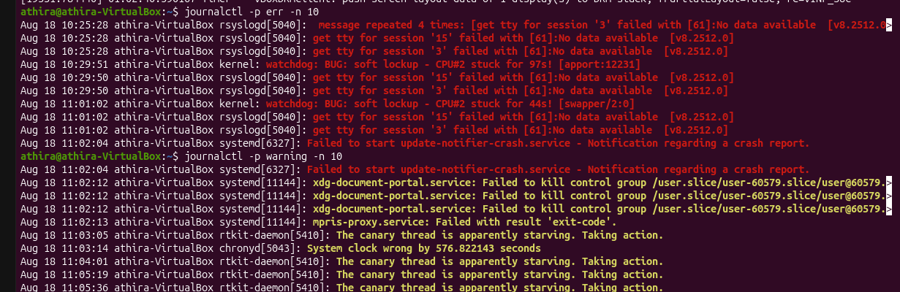

#### Kernel Logs

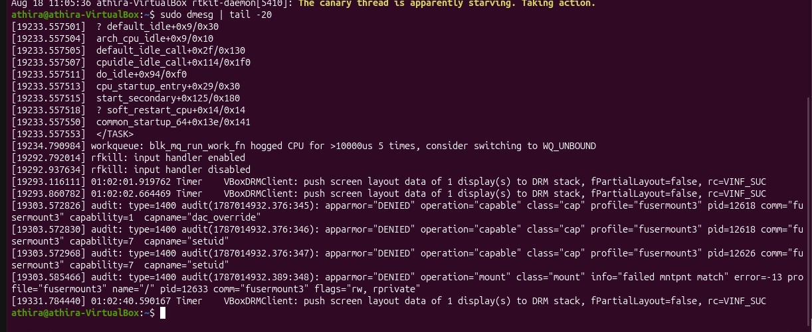

## Task 18 – Process & Service Troubleshooting

### Objective

Learn how to view running processes, identify processes by name, check running services, and troubleshoot service availability using `systemctl`.

### Commands Used

```bash
ps aux | head -20
pgrep -a systemd
systemctl list-units --type=service --state=running
systemctl status ssh
````

### What I Learned

**ps aux | head -20** – Displays a list of currently running processes with details such as the user, PID, CPU usage, memory usage, and command.

**pgrep -a systemd** – Searches for processes matching `systemd` and displays their process IDs and command lines.

**systemctl list-units --type=service --state=running** – Displays services that are currently active and running.

**systemctl status ssh** – Checks the status of the SSH service.

### Troubleshooting Notes

The system showed multiple active services, including NetworkManager, systemd-journald, systemd-resolved, cups, cron, and VirtualBox Guest Utilities.

When checking the SSH service, the command returned:

```text
Unit ssh.service could not be found.
```

This indicates that the SSH service is not installed or is not available under that service name on the system.

### Key Takeaway

Process and service troubleshooting helps identify whether a Linux application or background service is running and can help determine why a service may not be available.
### Screenshots

#### Process and Service Checks

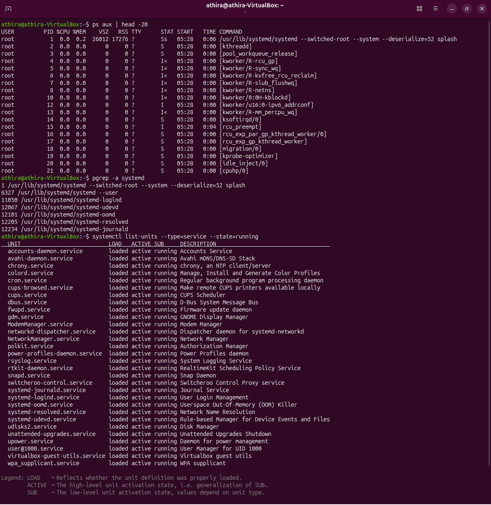

#### Service Status Check

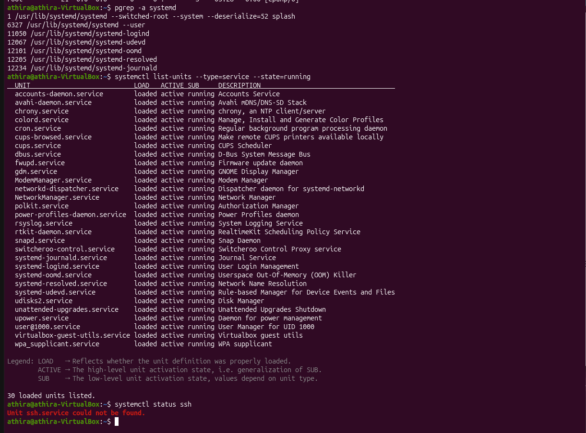

## Task 19 – Basic Linux Troubleshooting Scenario

### Scenario

A user reports that their Linux computer is running slowly. The objective is to investigate system load, memory usage, disk space, and resource-intensive processes.

### Commands Used

```bash
uptime
free -h
df -h
ps aux --sort=-%cpu | head -10
ps aux --sort=-%mem | head -10
````

### Troubleshooting Steps

1. Checked the system load using `uptime`.
2. Checked available and used memory using `free -h`.
3. Checked disk space using `df -h`.
4. Checked processes with the highest CPU usage.
5. Checked processes with the highest memory usage.

### Findings

* System load was very low: `0.00, 0.03, 0.10`.
* Approximately **5.9 GiB of memory was available**.
* The main filesystem `/dev/sda2` was **25% used**, with approximately **35 GB available**.
* No process showed unusually high CPU usage.
* GNOME Shell and Ptyxis were among the higher memory-using processes, but their usage was not excessive.

### Conclusion

The checks did not show a significant CPU, memory, or disk-space problem. The system had sufficient available memory and disk space, and the CPU load was low.

### Key Takeaway

A structured troubleshooting approach helps identify whether system performance issues are related to CPU, memory, disk space, or individual processes.

### Screenshot

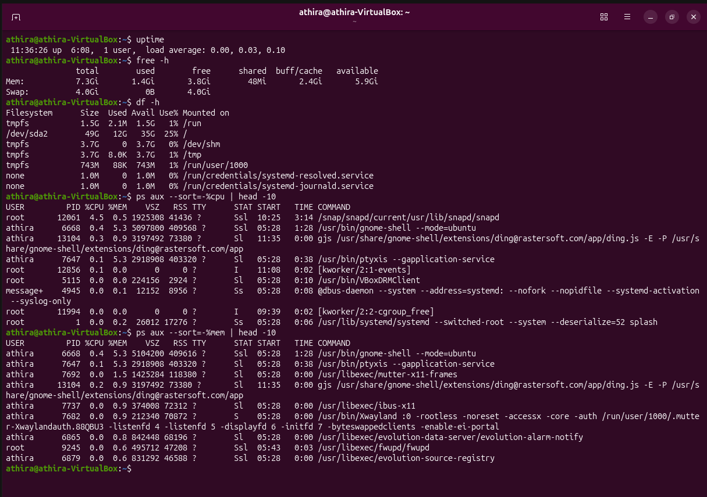


