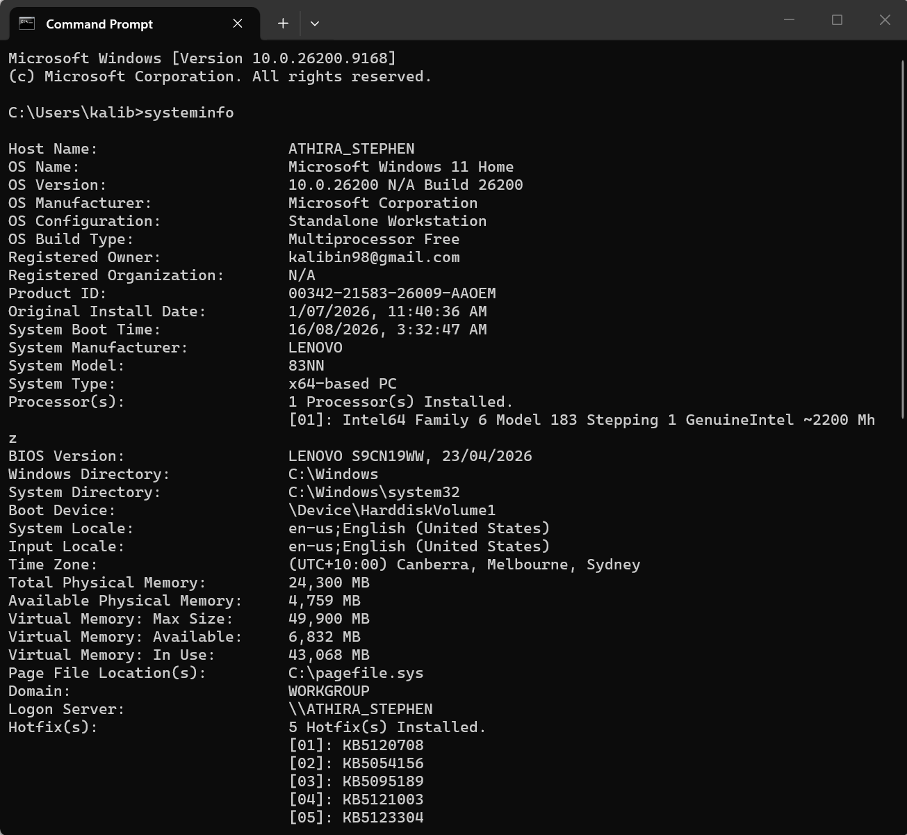
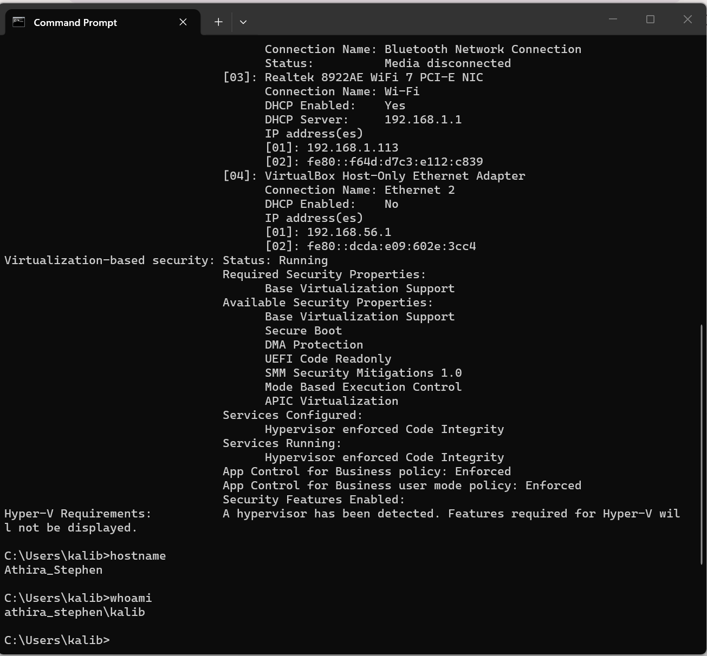
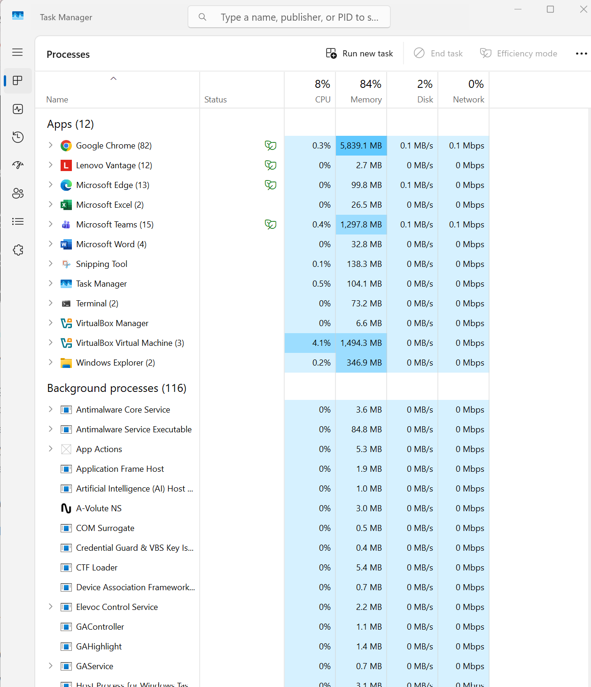
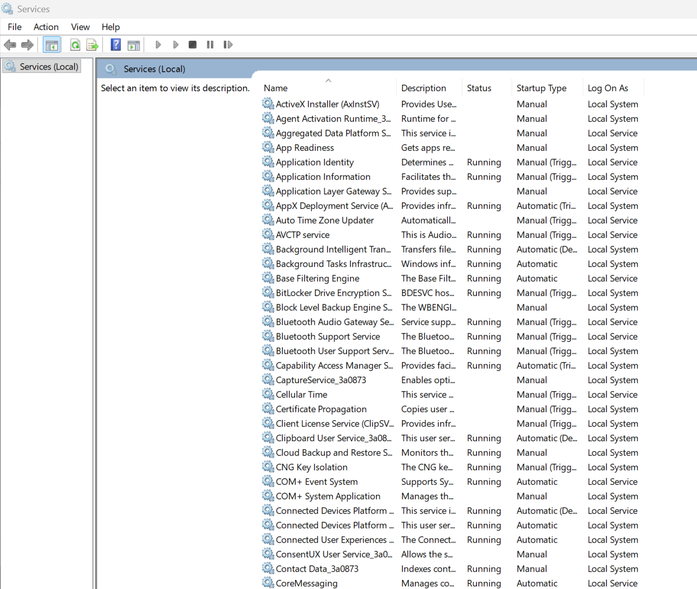
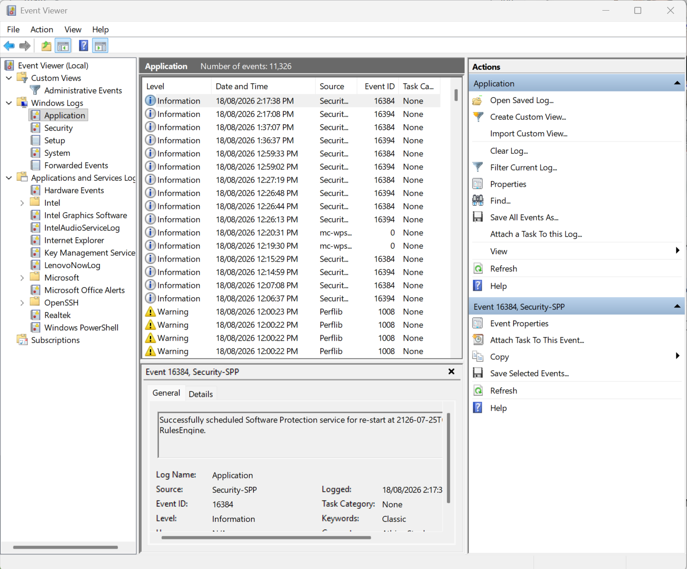

# Windows System Troubleshooting

## 📌 Overview

This project documents hands-on Windows troubleshooting and system administration tasks performed in a Windows environment.

## 🎯 Objectives

- Understand basic Windows system administration
- Investigate system performance
- Identify running processes and services
- Review Windows system information
- Practice using built-in Windows troubleshooting tools

## 🛠️ Tools Used

- Task Manager
- Windows Services
- System Information
- Command Prompt
- PowerShell
- Event Viewer

## 🧪 Lab Tasks

### 1. System Information

#### Objective

To gather basic Windows system information using built-in command-line tools.

#### Commands Used

```cmd
systeminfo
hostname
whoami
````

#### Information Checked

* Operating system and version
* System architecture
* Processor details
* Installed physical memory
* Computer name
* Current logged-in user
* Network configuration

#### Key Learning

Learned how to use built-in Windows command-line tools to quickly gather system information for IT support and troubleshooting.
#### Screenshots





### 2. Running Processes

#### Objective

To investigate running applications and background processes and review their resource usage using Windows Task Manager.

#### Tool Used

- Windows Task Manager

#### Information Checked

- Running applications
- Background processes
- CPU usage
- Memory usage
- Disk usage
- Network usage

#### Findings

Task Manager was used to review the processes currently running on the system.

At the time of testing:

- CPU usage was approximately **8%**
- Memory usage was approximately **84%**
- Disk usage was approximately **2%**
- Network usage was approximately **0%**

Google Chrome and Microsoft Teams were among the applications using higher amounts of memory, while VirtualBox was using some CPU and memory resources.

#### Key Learning

Learned how to use Windows Task Manager to identify running processes and monitor system resource usage. This can help IT support staff investigate performance-related issues.

#### Screenshot



### 3. Windows Services

#### Objective

To investigate Windows services and understand their status and startup configuration.

#### Tool Used

- Windows Services (`services.msc`)

#### Information Checked

- Service name
- Service description
- Service status
- Startup type
- Log On As account

#### Findings

Reviewed the Windows Services console to identify services that are currently running and their startup configurations.

Several services were shown as **Running**, with different startup types such as **Automatic** and **Manual**.

#### Key Learning

Learned how to review Windows services and check their status and startup configuration. This is useful for troubleshooting applications and system components that depend on Windows services.

#### Screenshot



### 4. Event Viewer

#### Objective

To review Windows event logs and understand how system and application events are recorded.

#### Tool Used

- Windows Event Viewer

#### Steps Performed

1. Opened **Event Viewer**.
2. Navigated to **Windows Logs → Application**.
3. Reviewed recorded application events.
4. Observed different event levels, including:
   - Information
   - Warning
5. Selected an event to review its details, including the event source and Event ID.

#### Findings

The Application log contained both informational and warning events. Event details can be used to investigate application and system issues.

#### Key Learning

Event Viewer is useful for troubleshooting because it provides detailed logs that can help identify errors, warnings, and other system events.

#### Screenshot



### 5. Command-Line Troubleshooting

Used Windows command-line tools to gather system and network information.

## 🧠 Key Learning

Windows troubleshooting should follow a structured approach:

1. Identify the problem
2. Gather information
3. Check system resources
4. Review processes and services
5. Check relevant logs
6. Identify the root cause
7. Apply and verify the solution

## 📚 Skills Demonstrated

- Windows troubleshooting
- System administration fundamentals
- Process investigation
- Service management
- Event log analysis
- Command-line troubleshooting
- Technical documentation
